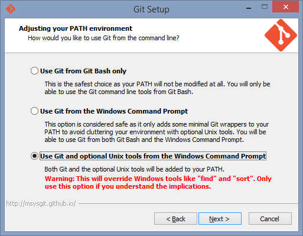

#addsshkey.bat
Es un script echo en batch y python para generar y registrar llaves ssh en windows.
##Requerimientos
- Debes tener instalado git, y su directorio junto con el de sus **herramientas Unix** agregados a la variable de entorno **PATH**. Para ello selecciona la tercera opción al momento de la instalación.

- Necesitas tener instalado **Python 3.***
